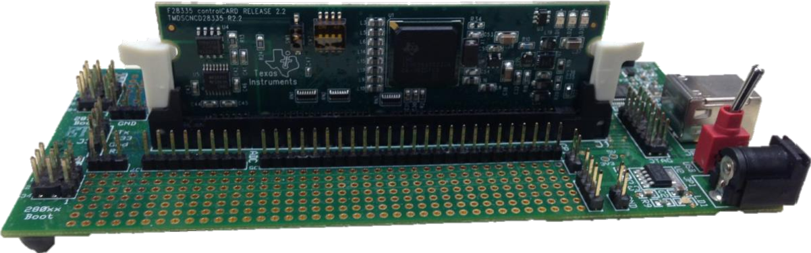
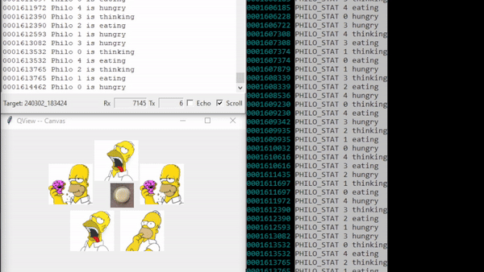

# Test of FreeRTOS port on TMS320F28335
This contains examples CCS (Code Composer Studio) projects that are used to test FreeRTOS port on TMS320F28335 DSP.

# Example Projects
## Blinky
This is a simple example that blinks the LED (500ms ON and 1500ms OFF).
### Hardware Test Setup
The setup is composed of C2000 DIMM100 Experimenter kit with TMDSCNCD28335 control card.

## QP-C on FreeRTOS: Dining Philosophers Problem (DPP)
This example demonstrates the [Dining Philosophers Problem (DPP) application](https://www.state-machine.com/qpc/tut_dpp.html) on the C2000 DIMM100 Experimenter kit with TMDSCNCD28335 control card.

